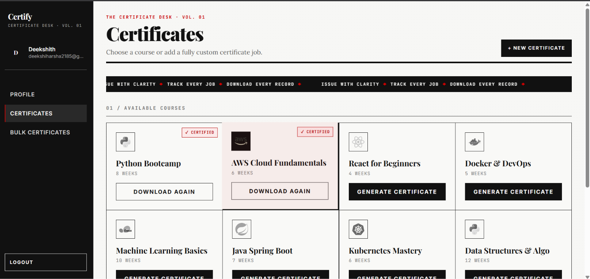
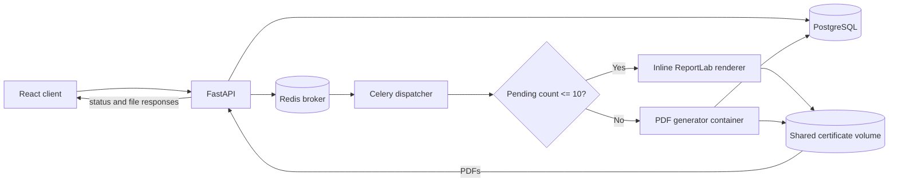
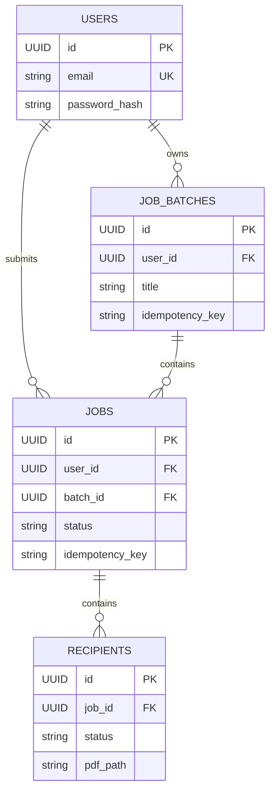

# Bulk Certificate Generator

Generate and retrieve personalized PDF certificates from a validated recipient list.

[](https://www.python.org/)
[](https://fastapi.tiangolo.com/)
[](https://docs.celeryq.dev/)
[](https://www.postgresql.org/)
[](https://redis.io/)
[](https://docs.docker.com/compose/)

## Table of contents

- [Overview](#overview)
- [Architecture](#architecture)
- [Technical specification](#technical-specification)
- [Data model](#data-model)
- [Setup](#setup)
- [Running the application](#running-the-application)
- [Running tests](#running-tests)
- [Using the API](#using-the-api)
- [Retrieving generated certificates](#retrieving-generated-certificates)
- [Design decisions and trade-offs](#design-decisions-and-trade-offs)
- [Reliability and failure handling](#reliability-and-failure-handling)
- [Performance and scalability](#performance-and-scalability)
- [Security notes](#security-notes)
- [Known limitations and future improvements](#known-limitations-and-future-improvements)
- [Interview cheat sheet](#interview-cheat-sheet)
- [Project structure](#project-structure)
- [License and author](#license-and-author)

## Overview

Organizations need to issue completion certificates to many participants without creating each document by hand.
A user uploads or submits a list of participants and selects the certificate details.
The API validates every recipient independently, records the job, and queues eligible work.
The dispatcher generates PDFs and stores them on shared storage; the API exposes job status and download routes.
The React frontend provides login, bulk submission, progress, and certificate retrieval.

Features:

- Bulk JSON input and frontend CSV import.
- Independent recipient validation and per-recipient failure isolation.
- Background processing through Celery and Redis.
- Job and recipient status tracking, including paged and filtered recipient listings.
- Single-certificate PDF download, job ZIP download, and combined batch PDF download.
- Large batch submissions split into child jobs; generated source PDFs expire from shared storage after the configured retention period.

### Screenshots

Sign-in, certificate selection, and an example generated certificate:

| Sign in | Certificates |
|---|---|
|  |  |


Bulk recipient entry and the resulting batch states:

| Bulk certificate submission | Completed batch |
|---|---|
|  |  |


Admin monitoring screenshots:

| System metrics | Container and pool details | Activity and failures |
|---|---|---|
|  |  |  |

Quick start:

```powershell
git clone https://github.com/deekshithgowda85/Certify.git
Set-Location Certify
Copy-Item .env.example .env
```

Set private `POSTGRES_PASSWORD` and `SECRET_KEY` values in `.env`, then build and start:

```powershell
docker compose up -d --build
```

Open `http://localhost:3000`; the API docs are at `http://localhost:8000/docs`.

## Architecture



| Service | Responsibility | Technology | Port |
|---|---|---|---|
| `frontend` | Browser UI and development server | React, Vite, Node | `3000` |
| `api` | Authentication, validation, persistence, status and download routes | FastAPI, SQLAlchemy, Alembic | `8000` |
| `db` | Persistent job and recipient records | PostgreSQL 15 | `5432` |
| `redis` | Celery broker/result backend and rate-limit counters | Redis 7 | `6379` |
| `dispatcher` | Queue consumer, inline generation, sandbox pool management | Celery, Python | No published port |
| PDF generator | Isolated rendering for larger jobs | Docker container, ReportLab | No published port |

The API and dispatcher share the certificate storage volume. The PDF generator containers also mount that volume and connect to PostgreSQL to record recipient outcomes.

### Request flow

1. The client sends a request to `POST /api/v1/jobs` or `POST /api/v1/jobs/batches`. The corresponding route in `api/app/api/v1/jobs.py` or `job_batches.py` validates the request schema.
2. `api/app/services/job_service.py` validates recipient rows, stores jobs and recipients, and records invalid rows as failures. A batch is divided into child jobs according to `MAX_RECIPIENTS_PER_JOB`.
3. The API submits eligible child-job IDs to the `certificates` Celery queue through its task enqueue helper.
4. `dispatcher/app/tasks/certificate_task.py` loads pending recipients and chooses inline rendering or sandbox processing using the threshold in `dispatcher/app/config.py`.
5. Inline rendering uses `dispatcher/app/services/inline_generator.py` and `dispatcher/app/certificate/pdf_builder.py`. Sandbox work uses `dispatcher/app/services/sandbox_runner.py`, `dispatcher/app/pool/container_pool.py`, and `pdf_generator/generate.py`.
6. The dispatcher records each recipient outcome in PostgreSQL and writes successful PDFs under the shared storage root.
7. The client polls job or batch status and retrieves an individual PDF, a job ZIP, or a merged batch PDF through the download routes. Batch merge and file response handling are implemented in the batch API/service code.

## Technical specification

### Stack

| Component | Version or source |
|---|---|
| Python | `3.11` base images; benchmark container reported Python `3.11.17` |
| FastAPI | `0.111.0` |
| Celery | `5.4.0` |
| SQLAlchemy | `2.0.30` |
| Alembic | `1.13.1` |
| ReportLab | `4.1.0` |
| PostgreSQL | `postgres:15-alpine` Compose image |
| Redis | `redis:7-alpine` Compose image |
| Frontend | React `^18.3.1`, Vite `^5.3.4` |
| Containers | Docker Compose v2 configuration; service definitions in `docker-compose.yml` |

Python dependency versions are from the service dependency manifests; frontend ranges are from its package manifest. Docker image tags above are the configured Compose tags, not a claim about the exact patch release currently pulled by every machine.

### Limits and validation

| Rule | Value |
|---|---|
| Maximum recipients in one job | `MAX_RECIPIENTS_PER_JOB`, default `10,000` |
| Maximum recipients in one batch submission | `100,000` |
| Batch splitting | Child jobs contain at most `10,000` recipients |
| Job or batch title | Required after trimming; maximum `255` characters |
| `Idempotency-Key` header | Optional; when supplied, length must be `1`–`255` characters after trimming |
| `name`, `course_name` | Required after trimming; maximum `255` characters |
| `email` | Required valid email address; maximum `255` characters |
| `completion_date` | Required date in exact `YYYY-MM-DD` form; must be a real calendar date and not future-dated in the supplied timezone |
| `client_timezone` | IANA timezone name; defaults to `UTC` |
| Recipient validation | Independent per row. Invalid rows are persisted as `FAILED` with validation information. |
| Invalid-row database values | Best-effort values are retained; an unparseable completion date uses `1970-01-01` as the database placeholder. |
| All-invalid single job | Rejected with `422 Unprocessable Entity` |
| All-invalid batch | Batch is recorded as failed; no generation task is needed |
| Recipient listing | Page number is at least `1`; page size is `1`–`100` (API default `20`). The frontend requests `50` per page. |
| Frontend CSV | Header names are normalized; required columns are `name`, `email`, `course_name`, `completion_date`. CSV upload is capped at `20 MiB` and `100,000` data rows. |
| Job ZIP | `ZIP_STORED` (no compression), ZIP64 enabled |
| Source PDF retention | Default `600` seconds; cleanup checks at a default `60`-second interval |

The CSV constraints are enforced by the frontend importer; JSON API requests are governed by the API schemas and service validation.

### Processing configuration

| Setting | Default | Behavior |
|---|---:|---|
| Inline threshold | `10` pending recipients | Up to and including this count uses inline generation; larger counts use sandbox containers. |
| Recipients in a sandbox task | Up to `10,000` per child job | A sandbox task processes the pending recipients for its job; it is not a fixed-size sub-batch. |
| Warm pool | `2` idle containers | Pool keeps idle generator containers available. |
| Maximum pool size / Celery concurrency | `5` | Compose starts the dispatcher with a thread pool and concurrency matching `SANDBOX_MAX_CONTAINERS`. |
| Celery pool | `threads` | Compose worker command uses `--pool=threads`, not prefork. |
| Sandbox memory | `256 MiB` | Per generator container. |
| Sandbox CPU | `0.5` CPU | Configured as a `50,000` quota per `100,000`-microsecond period. |
| Sandbox execution timeout | `300` seconds | Container task timeout. |
| Sandbox slot wait | `120` seconds | Maximum configured wait to acquire a pool slot. |
| Celery soft / hard time limit | `600` / `660` seconds | Task-level limits. |
| Task retry count | `3` retries | Retry delays are `5`, `10`, and `20` seconds using `min(60, 5 * 2 ** retries)`. |
| Celery queue | `certificates` | Queue consumed by the dispatcher. |
| Worker prefetch | `1` | Worker reserves one task at a time per worker thread. |
| Late acknowledgement | Enabled | Celery acknowledges tasks after task execution rather than before it. |

The pool and worker concurrency are process-local. Starting additional dispatcher replicas creates additional pools; the Compose defaults do not coordinate a single global pool limit.

### Statuses

| Entity | Status | When it is set |
|---|---|---|
| Job | `PENDING` | Created with eligible recipients, before dispatcher processing. |
| Job | `PROCESSING` | Dispatcher starts processing the job. |
| Job | `COMPLETED` | All recipients have completed and none failed. |
| Job | `PARTIALLY_FAILED` | Processing has finished with both successful and failed recipients. |
| Job | `FAILED` | No recipient succeeded, all rows were invalid, or processing exhausted its retries. |
| Recipient | `PENDING` | Valid recipient is accepted and awaits generation. |
| Recipient | `SUCCESS` | PDF generation succeeds and the output path is recorded. |
| Recipient | `FAILED` | Input validation or certificate generation fails. |

API validation accounts for invalid rows as failed immediately. Dispatcher finalization computes `processed_count` from successful plus failed recipients; conditional recipient updates avoid incrementing counters twice for the same terminal outcome.

### Environment variables

The Compose defaults and application settings are defined across `docker-compose.yml`, `.env.example`, `api/app/config.py`, and `dispatcher/app/config.py`. Values described as Compose defaults can be overridden by `.env`.

| Variable | Default | Meaning |
|---|---|---|
| `POSTGRES_DB` | `certificates_db` | Database name passed to the PostgreSQL service. |
| `POSTGRES_USER` | `postgres` | Local Compose database user. |
| `POSTGRES_PASSWORD` | `postgres` in Compose | Local-only default; replace before exposing the stack. |
| `DATABASE_URL` | `.env.example` connection to `db:5432/certificates_db` | Async SQLAlchemy connection string; credentials are supplied in `.env`. |
| `REDIS_URL` | `redis://redis:6379/0` | Redis URL used for Redis-backed application features. |
| `CELERY_BROKER_URL` | `redis://redis:6379/0` | Celery broker URL. |
| `CELERY_RESULT_BACKEND` | `redis://redis:6379/1` | Celery result backend URL. |
| `CELERY_TASK_ALWAYS_EAGER` | `false` | Celery eager-task setting used by the application configuration. |
| `SECRET_KEY` | `change-me-in-production` in application settings | JWT signing secret. Set a private random value for any deployed environment. |
| `ALGORITHM` | `HS256` | JWT signing algorithm. |
| Token lifetime | `7` days in `api/app/auth.py` | JWT expiry is currently hard-coded rather than controlled by an environment variable. |
| `DEBUG` | `false` in settings; `.env.example` enables development mode | API debug setting. |
| `TESTING` | `false` | Application testing-mode setting. |
| `RUN_MIGRATIONS` | `true` | Run Alembic migrations during API startup. |
| `APP_VERSION` | `1.0.0` | API and health-response version string. |
| `STORAGE_PATH` | `/app/storage/certificates` | Shared root for generated source PDFs. |
| `CERTIFICATE_TTL_SECONDS` | `600` | Age after which stored source PDFs are eligible for cleanup. |
| `CERTIFICATE_CLEANUP_INTERVAL_SECONDS` | `60` | Delay between cleanup scans. |
| `MAX_RECIPIENTS_PER_JOB` | `10,000` | Maximum recipients persisted in one child job. |
| `SANDBOX_THRESHOLD` | `10` | Pending-recipient count above which sandbox processing is selected. |
| `SANDBOX_MIN_IDLE` | `2` | Warm idle container count. |
| `SANDBOX_MAX_CONTAINERS` | `5` | Pool maximum and Compose dispatcher concurrency. |
| `SANDBOX_IMAGE` | `bulk-certificate-generator-pdf-generator:latest` | Image used for generator containers. |
| `SANDBOX_CONTAINER_PREFIX` | `sandbox` | Prefix for pool-created container names. |
| `SANDBOX_NETWORK` | `certify_default` | Docker network used by sandbox containers; Compose derives it from the project name. |
| `SANDBOX_VOLUME` | `bulk-certificate-generator_certificate_storage` | Docker volume mounted into sandbox containers. |
| `SANDBOX_MEM_LIMIT` | `256m` | Generator-container memory limit. |
| `SANDBOX_CPU_PERIOD` | `100000` | CPU quota period in microseconds. |
| `SANDBOX_CPU_QUOTA` | `50000` | CPU quota in microseconds per period. |
| `SANDBOX_TIMEOUT_SECONDS` | `300` | Sandbox execution timeout. |
| `SANDBOX_SLOT_WAIT_SECONDS` | `120` | Pool-slot acquisition timeout. |
| `TASK_SOFT_TIME_LIMIT` | `600` | Celery task soft time limit in seconds. |
| `TASK_TIME_LIMIT` | `660` | Celery task hard time limit in seconds. |
| `CELERY_QUEUE` | `certificates` | Celery queue name. |
| `RATE_LIMIT_WINDOW_SECONDS` | `60` | Fixed-window rate-limit duration. |
| `AUTH_RATE_LIMIT_PER_MINUTE` | `5` requests/window | Authentication route limit per client IP. |
| `JOB_RATE_LIMIT_PER_MINUTE` | `10` requests/window | Authenticated job creation/regeneration limit per user. |
| `PUBLIC_JOB_RATE_LIMIT_PER_MINUTE` | `3` requests/window | Public creation/regeneration limit per client IP; public job and batch creation share a scope. |
| `CERTIFICATE_TASK_NAME` | `app.tasks.certificate_task.certificate_task` | Celery task name submitted by the API. |
| `COMPOSE_PROJECT_NAME` | Compose project name `certify` | Influences the sandbox network name. |

Some environment variables are set directly by Compose and are not present in `.env.example`; the values above reflect the application defaults and Compose substitutions in this repository.

## Data model

The database is managed with SQLAlchemy models and Alembic migrations. PostgreSQL stores users, batch submissions, jobs, and recipients. PDF bytes are files, not database blobs.

| Table | Principal columns | Constraints and indexes |
|---|---|---|
| Table | Columns and types | Constraints and indexes |
|---|---|---|
| `users` | `id UUID`; `full_name VARCHAR(255)`; `email VARCHAR(255)`; `password_hash VARCHAR(255)`; `created_at`, `updated_at TIMESTAMP WITH TIME ZONE` | `id` primary key; `email` non-null, unique, and indexed; other required fields non-null. |
| `job_batches` | `id UUID`; nullable `user_id UUID`; `title VARCHAR(255)`; nullable `idempotency_key VARCHAR(255)`; nullable `request_fingerprint VARCHAR(64)`; timestamps | `id` primary key; nullable user foreign key with `ON DELETE CASCADE`, indexed; unique `(user_id, idempotency_key)`. Batch status and counters are aggregated from child jobs, not stored as columns on this table. |
| `jobs` | `id UUID`; nullable `batch_id UUID`, `user_id UUID`; `title VARCHAR(255)`; `status VARCHAR(20)`; nullable `processing_mode VARCHAR(10)`; integer total/processed/success/failed/valid/invalid counts; nullable `idempotency_key VARCHAR(255)`, `request_fingerprint VARCHAR(64)`, `enqueue_error TEXT`, `container_id VARCHAR(64)`; timestamps | `id` primary key; batch foreign key cascades and is indexed; user foreign key and index; status index; unique `(user_id, idempotency_key)`. Counts and status are non-null; processing mode and error/container details are nullable. |
| `recipients` | `id UUID`; nullable `source_index INTEGER`; `job_id UUID`; `name`, `email`, `course_name VARCHAR(255)`; `completion_date DATE`; `status VARCHAR(10)`; nullable `error_message TEXT`, `certificate_path VARCHAR(512)`; timestamps | `id` primary key; required job foreign key with `ON DELETE CASCADE`; indexes on `job_id` and `(job_id, status)`; required participant fields and status are non-null. |

The definitions above reflect the SQLAlchemy models and Alembic migrations; timestamps are timezone-aware. Status values are stored as strings and validated by application code rather than database enum types.



### Counter consistency

- The API marks invalid recipients `FAILED` when it creates the job and initializes the failed count accordingly.
- Each worker outcome is applied only if the recipient is still pending; terminal rows are not counted a second time.
- Job finalization derives processed count from successful plus failed recipients and determines the terminal job status from those totals.
- A batch aggregates child-job outcomes. The database remains the source of truth for recipient state; counters are maintained alongside recipient updates.

## Setup

Prerequisites: Docker Engine with Docker Compose v2, Git, and an available Docker daemon. The checked-in stack supplies PostgreSQL and Redis as containers; local Python and Node installations are not required for the Docker workflow.

```powershell
git clone https://github.com/deekshithgowda85/Certify.git
Set-Location Certify
Copy-Item .env.example .env
```

Edit `.env` before starting the stack. Set `POSTGRES_PASSWORD` and `SECRET_KEY` to private values; keep the database URL credentials consistent with the PostgreSQL variables. The example is intended for local development, not production.

Build and start the services:

```powershell
docker compose up -d --build
```

The API runs migrations on startup when `RUN_MIGRATIONS` is enabled. For an explicit manual migration, use the command in [Running the application](#running-the-application).

## Running the application

Start or rebuild the complete development stack:

```powershell
docker compose up -d --build
```

Check status and logs:

```powershell
docker compose ps
docker compose logs -f api dispatcher
```

Stop containers without deleting database or certificate volumes:

```powershell
docker compose down
```

URLs:

| Purpose | URL |
|---|---|
| Frontend | `http://localhost:3000` |
| API | `http://localhost:8000` |
| Interactive API docs | `http://localhost:8000/docs` |
| Health check | `http://localhost:8000/api/v1/health` |

Run or inspect migrations:

```powershell
docker compose exec api alembic -c /app/alembic/alembic.ini upgrade head
docker compose exec api alembic -c /app/alembic/alembic.ini current
```

Scale dispatcher workers by changing `SANDBOX_MAX_CONTAINERS` in `.env`, then recreate the dispatcher:

```powershell
docker compose up -d --build --force-recreate dispatcher
```

Add dispatcher replicas with:

```powershell
docker compose up -d --scale dispatcher=$env:DISPATCHER_REPLICAS
```

Set `$env:DISPATCHER_REPLICAS` to the desired replica count first. Changing `SANDBOX_MAX_CONTAINERS` adjusts concurrency and the pool maximum for each replica. Replicas have independent local pools but share PostgreSQL, Redis, and certificate storage; no global pool coordinator is implemented.

## Running tests

Run the API and shared API test suite in the API container:

```powershell
docker compose exec -T api pytest tests/ -q
```

Observed result: **94 passed**.

Run the dispatcher-specific test modules in the dispatcher container:

```powershell
docker compose exec -T dispatcher python -m pytest tests/test_inline_mode.py tests/test_threshold_switching.py tests/test_certificate_pdf.py tests/test_container_pool.py -v --tb=short
```

Observed result: **23 passed**.

| Test file | Coverage |
|---|---|
| `tests/test_api_jobs.py` | Job creation, recipient validation and listing, status and download API behavior. |
| `tests/test_api_batches.py` | Batch splitting, batch status, batch downloads and regeneration behavior. |
| `tests/test_api_public_jobs.py` | Anonymous job creation, status, recipients and download routes. |
| `tests/test_auth.py` | Registration, login, bearer-token authorization and user routes. |
| `tests/test_validation.py` | Recipient field and completion-date validation. |
| `tests/test_rate_limit.py` | Redis-backed API rate-limit behavior. |
| `tests/test_api_metrics.py` | Admin metrics route behavior. |
| `tests/test_inline_mode.py` | Inline task processing. |
| `tests/test_threshold_switching.py` | Selection between inline and sandbox modes. |
| `tests/test_certificate_pdf.py` | PDF output generation and file handling. |
| `tests/test_container_pool.py` | Sandbox pool lifecycle and acquisition behavior. |

The test fixture creates or reuses the PostgreSQL database `certificates_test`, recreates the SQLAlchemy schema, and truncates project tables between tests. API tests mock Celery enqueueing and replace the Redis rate-limit client with a test double; these are functional tests, not production-throughput measurements. The dispatcher image does not include FastAPI, so the whole shared test directory cannot run there because API-only tests require that dependency. Use the explicit dispatcher module selector above. The pass counts are the results of the commands shown, not estimates.

The fixture drops and recreates tables in the test database; never point `DATABASE_URL` or `TEST_DB_NAME` at a production database.

## Using the API

API routes are under `/api/v1`. Authenticated routes require a bearer access token; public job and batch routes use their public UUID identifier. The API docs at `/docs` show request schemas for the running version.

### Endpoint reference

| Method | Path | Success | Common error codes |
|---|---|---:|---|
| `POST` | `/api/v1/auth/register` | `201` | `409`, `422`, `429`, `503` |
| `POST` | `/api/v1/auth/login` | `200` | `401`, `422`, `429`, `503` |
| `GET` | `/api/v1/auth/me` | `200` | `401` |
| `PATCH` | `/api/v1/auth/me` | `200` | `401`, `422` |
| `POST` | `/api/v1/jobs` | `202` | `401`, `409`, `422`, `429`, `503` |
| `GET` | `/api/v1/jobs` | `200` | `401` |
| `GET` | `/api/v1/jobs/{job_id}` | `200` | `401`, `404` |
| `GET` | `/api/v1/jobs/{job_id}/recipients` | `200` | `401`, `404`, `422` |
| `GET` | `/api/v1/jobs/{job_id}/certificates/{recipient_id}` | `200` | `401`, `404` |
| `GET` | `/api/v1/jobs/{job_id}/certificates/download-all` | `200` | `401`, `404` |
| `POST` | `/api/v1/jobs/batches` | `202` | `401`, `409`, `422`, `429`, `503` |
| `GET` | `/api/v1/jobs/batches/{batch_id}` | `200` | `401`, `404` |
| `GET` | `/api/v1/jobs/batches/{batch_id}/recipients` | `200` | `401`, `404`, `422` |
| `GET` | `/api/v1/jobs/batches/{batch_id}/certificates/download-all` | `200` | `401`, `404`, `410` |
| `POST` | `/api/v1/jobs/batches/{batch_id}/regenerate` | `202` | `401`, `404`, `409`, `429` |
| `POST` | `/api/v1/public/jobs` | `202` | `422`, `429`, `503` |
| `GET` | `/api/v1/public/jobs/{job_id}` | `200` | `404` |
| `GET` | `/api/v1/public/jobs/{job_id}/recipients` | `200` | `404`, `422` |
| `GET` | `/api/v1/public/jobs/{job_id}/certificates/{recipient_id}` | `200` | `404` |
| `GET` | `/api/v1/public/jobs/{job_id}/certificates/download-all` | `200` | `404` |
| `POST` | `/api/v1/public/batches` | `202` | `422`, `429`, `503` |
| `GET` | `/api/v1/public/batches/{batch_id}` | `200` | `404` |
| `GET` | `/api/v1/public/batches/{batch_id}/recipients` | `200` | `404`, `422` |
| `GET` | `/api/v1/public/batches/{batch_id}/certificates/download-all` | `200` | `404`, `410` |
| `POST` | `/api/v1/public/batches/{batch_id}/regenerate` | `202` | `404`, `409`, `429`, `503` |
| `GET` | `/api/v1/health` | `200` | `503` |
| `GET` | `/api/v1/admin/metrics` | `200` | `503` |
| `GET` | `/api/v1/pool/status` | `200` | `503` |

Route-level error codes depend on authentication, ownership, request validation, rate limiting, and storage state. See the route handlers for exact response details.

### Create a valid job

Replace `TOKEN` with a bearer token from the login route.

<details>
<summary>Request and response example</summary>

```bash
curl -X POST http://localhost:8000/api/v1/jobs \
  -H "Authorization: Bearer TOKEN" \
  -H "Content-Type: application/json" \
  -H "Idempotency-Key: interview-demo" \
  --data-binary @- <<JSON
{
    "title": "Interview demo",
    "recipients": [
      {
        "name": "Avery Morgan",
        "email": "avery@example.com",
        "course_name": "Data Foundations",
        "completion_date": "$(date -u +%F)"
      }
    ]
}
JSON
```

The response contains a generated job UUID, status, recipient counters, and a message. This example UUID is from the response schema; actual IDs are generated at request time.

```json
{
  "job_id": "d9a22120-8fdb-48c9-9ea7-725393f4d3b2",
  "status": "PENDING",
  "total_recipients": 1,
  "valid_recipients": 1,
  "invalid_recipients": 0,
  "message": "Job queued. Mode will be decided by dispatcher."
}
```

</details>

### Create a job with an invalid recipient

Validation is independent per recipient. A request with at least one valid recipient is accepted; invalid rows are stored as `FAILED` with validation details. If every row in a single job is invalid, the API returns `422`.

<details>
<summary>Request showing one valid and one invalid row</summary>

```bash
curl -X POST http://localhost:8000/api/v1/jobs \
  -H "Authorization: Bearer TOKEN" \
  -H "Content-Type: application/json" \
  --data-binary @- <<JSON
{
    "title": "Interview demo",
    "recipients": [
      {
        "name": "Avery Morgan",
        "email": "avery@example.com",
        "course_name": "Data Foundations",
        "completion_date": "$(date -u +%F)"
      },
      {
        "name": "",
        "email": "not-an-email",
        "course_name": "Data Foundations",
        "completion_date": "$(date -u +%F)"
      }
    ]
}
JSON
```

The response has the following shape for one valid and one invalid row; the generated UUID differs per request.

```json
{
  "job_id": "d9a22120-8fdb-48c9-9ea7-725393f4d3b2",
  "status": "PENDING",
  "total_recipients": 2,
  "valid_recipients": 1,
  "invalid_recipients": 1,
  "message": "Job queued. Mode will be decided by dispatcher."
}
```

</details>

### Get status and list recipients

```bash
curl http://localhost:8000/api/v1/jobs/JOB_ID \
  -H "Authorization: Bearer TOKEN"

curl "http://localhost:8000/api/v1/jobs/JOB_ID/recipients?status=SUCCESS&page=1&size=50" \
  -H "Authorization: Bearer TOKEN"
```

The recipient listing supports status filtering and pagination. The frontend requests pages of `50`.

Example job-status response (the values below are the API schema example):

```json
{
  "job_id": "d9a22120-8fdb-48c9-9ea7-725393f4d3b2",
  "title": "Python Bootcamp",
  "status": "PROCESSING",
  "processing_mode": "INLINE",
  "total_recipients": 50,
  "processed_count": 12,
  "success_count": 11,
  "failed_count": 1,
  "container_id": null,
  "created_at": "2026-10-07T12:00:00Z",
  "updated_at": "2026-10-07T12:01:00Z"
}
```

Example recipient-list response:

The example uses the response schema fields and the requested page size; row values depend on the job.

```json
{
  "job_id": "d9a22120-8fdb-48c9-9ea7-725393f4d3b2",
  "total": 25,
  "page": 1,
  "size": 50,
  "recipients": [
    {
      "id": "8f951b0d-7222-47ac-8cc7-d477c88a88f3",
      "name": "Ada Lovelace",
      "email": "ada@example.com",
      "status": "SUCCESS",
      "error_message": null,
      "certificate_url": "/api/v1/jobs/d9a22120-8fdb-48c9-9ea7-725393f4d3b2/certificates/8f951b0d-7222-47ac-8cc7-d477c88a88f3"
    }
  ]
}
```

### Download a certificate, job ZIP, or batch PDF

```bash
curl -L http://localhost:8000/api/v1/jobs/JOB_ID/certificates/RECIPIENT_ID \
  -H "Authorization: Bearer TOKEN" \
  -o certificate.pdf

curl -L http://localhost:8000/api/v1/jobs/JOB_ID/certificates/download-all \
  -H "Authorization: Bearer TOKEN" \
  -o certificates.zip

curl -L http://localhost:8000/api/v1/jobs/batches/BATCH_ID/certificates/download-all \
  -H "Authorization: Bearer TOKEN" \
  -o batch-certificates.pdf
```

These download responses contain binary files rather than JSON: a certificate and merged batch use `application/pdf`; the job archive uses `application/zip`. The `-o` options save the response bodies to local files.

### Health check

```bash
curl http://localhost:8000/api/v1/health
```

The health handler checks application dependencies and returns `503` when it cannot report healthy.

Healthy response (the API schema example):

```json
{
  "status": "ok",
  "db": "ok",
  "broker": "ok",
  "version": "1.0.0"
}
```

### Poll until a job completes

Set `POLL_INTERVAL_SECONDS` to a client-chosen delay; the API does not prescribe a polling interval.

```bash
while true; do
  response=$(curl -sS http://localhost:8000/api/v1/jobs/JOB_ID \
    -H "Authorization: Bearer TOKEN")
  printf '%s\n' "$response"
  status=$(printf '%s' "$response" | python -c \
    'import json,sys; print(json.load(sys.stdin)["status"])')
  case "$status" in
    COMPLETED|PARTIALLY_FAILED|FAILED) break ;;
  esac
  sleep "${POLL_INTERVAL_SECONDS:?Set a client-chosen polling delay}"
done
```

### CSV-to-JSON tip

The frontend accepts CSV with `name`, `email`, `course_name`, and `completion_date` columns and converts it to the API payload. For scripts, Python’s standard `csv` module can perform the conversion:

```python
import csv
import json

with open("recipients.csv", newline="", encoding="utf-8-sig") as csv_file:
    recipients = list(csv.DictReader(csv_file))

for recipient in recipients:
    recipient["client_timezone"] = "UTC"

payload = {"title": "CSV upload", "recipients": recipients}
print(json.dumps(payload))
```

## Retrieving generated certificates

- Successful source PDFs are stored beneath `STORAGE_PATH`, defaulting to `/app/storage/certificates`.
- A recipient path is stored relative to that root in the form `<job_id>/<recipient_id>.pdf`; the database does not store an absolute host path.
- The API resolves the relative path beneath the configured root and checks that the resolved file remains inside that root before serving it.
- Individual certificates are returned as PDF responses. A job download packages its PDFs into a ZIP named from the job; ZIP entries use safe recipient-based names.
- Batch download merges the available child-job certificate PDFs into one PDF. The merged response is staged as a temporary download file and removed after the response completes.
- Source PDFs are eligible for deletion after `CERTIFICATE_TTL_SECONDS` (default `600` seconds); the cleanup loop scans at `CERTIFICATE_CLEANUP_INTERVAL_SECONDS` (default `60` seconds). Downloading an expired batch returns `410 Gone`; regeneration can queue successful recipients again.
- Temporary response files are cleaned up after normal response completion. An API process crash can leave a temporary merged download file behind; the periodic source-PDF cleanup does not sweep those temporary files.

## Design decisions and trade-offs

| Decision | Why | Alternative rejected | Trade-off |
|---|---|---|---|
| Background processing with `202 Accepted` and polling | PDF generation may take longer than an HTTP request should remain open. | Hold the HTTP request until every certificate is rendered. | Clients need to poll and handle intermediate states. |
| Celery with Redis | Provides a broker-backed task queue and retry configuration shared by the API and dispatcher. | FastAPI `BackgroundTasks`, which run inside the API process. | More services and operations; workers can scale separately. |
| Inline for up to `10` pending recipients; sandbox above that | Small jobs avoid container startup and pool acquisition overhead; larger jobs use isolated renderer containers. | Run all jobs in containers or all inside the API. | Threshold is a fixed configuration choice and has not been selected from an end-to-end load study. |
| Warm container pool | Reuses renderer containers instead of starting a new container for each task. | Spawn one generator container per job. | Pool limits are local to a dispatcher process and consume idle resources. |
| Commit recipient outcomes independently | A single rendering failure should not erase or block other recipient results. | One transaction spanning an entire large job. | More database transactions; jobs can be partially complete. |
| Persist invalid recipients as `FAILED` | The accepted rows and their validation outcomes remain visible alongside successful recipients. | Reject any request containing one invalid row. | Invalid rows count toward job totals and require clients to inspect results. |
| Store relative PDF paths | Allows the storage root to differ between container and host without persisting machine-specific absolute paths. | Store absolute container paths in PostgreSQL. | Every read must resolve and validate the path against `STORAGE_PATH`. |
| Write PDFs atomically | A final path is not exposed until the complete temporary PDF is ready. | Write directly to the final path. | Temporary disk space is needed during generation. |
| PostgreSQL for durable records | Relational constraints, indexed status queries, and transactions fit the job/recipient relationships. | Store job state only in Redis or flat files. | Requires database migrations and operations. |
| ReportLab for PDF rendering | Python renderer can build the certificate PDFs in both inline and isolated paths. | External PDF-generation service. | Layout/design changes are implemented and tested in this repository. |

## Reliability and failure handling

| Failure | Implemented behavior |
|---|---|
| One recipient PDF fails | That recipient is marked `FAILED`; other recipients in the job continue. |
| Sandbox process exits unsuccessfully | The task raises a processing failure and Celery retries according to the configured retry count and delay. |
| Task retries are exhausted | Pending recipients are marked failed during task failure handling where the database is reachable. |
| Worker process crashes | Celery late acknowledgement is enabled. Recipient results are committed independently, but there is no explicit stale-job scanner or reconciler; automatic recovery of every interrupted job is not guaranteed. |
| Redis is unavailable | Rate-limited routes cannot use their counters and return a service error; Celery cannot publish or consume queued work until the broker is available. |
| PostgreSQL is unavailable | API persistence and dispatcher updates fail; a successful job-status response cannot be guaranteed. A database outage can also prevent failure finalization from updating recipient state. |
| Source certificate expires or is missing | Single-file retrieval returns not found; batch download reports `410` when the batch certificates have expired, and regeneration can enqueue successful recipients again. |
| Duplicate/idempotent request | The idempotency key and request fingerprint are checked for authenticated creation; reuse with a different payload conflicts. |

The code does not provide a general dead-letter workflow, durable object-storage backend, or worker-loss reconciliation task. These should not be inferred from Celery retries or late acknowledgements.

## Performance and scalability

The benchmark script `scripts/benchmark.py` calls the production inline `generate_pdf` function directly, writes real PDFs in a temporary directory, and removes the output afterward. It does not call the API, use PostgreSQL or Redis, enqueue Celery work, run the sandbox container path, or merge a batch PDF.

### Measured inline-renderer results

| Recipients rendered | Elapsed time | Certificates / second | Output PDF bytes | Average bytes / PDF |
|---:|---:|---:|---:|---:|
| 10 | `0.028 s` | `355.31` | `54,230` | `5,423` |
| 100 | `0.253 s` | `395.88` | `542,300` | `5,423` |
| 1,000 | `2.964 s` | `337.37` | `5,423,000` | `5,423` |
| 10,000 | `32.162 s` | `310.93` | `54,230,000` | `5,423` |

| Measurement requested | Result |
|---|---|
| Inline direct-render throughput | Measured in the table above; it excludes API, database, queue, and merge work. |
| Sandbox/container throughput | Not measured. |
| End-to-end times for batches of 10, 100, 1,000, and 10,000 | Not measured. |
| Per-container memory | Not measured. |
| Direct-render process peak RSS | `31.73 MiB` for the benchmark run; this is the process peak, not sandbox-container memory. |
| Hardware | Windows host, Intel 12th Gen Core i5-12450HX (8 cores / 12 logical processors), `15.71 GiB` RAM; Docker Engine `28.3.0`, Docker Compose `v2.38.1-desktop.1`; benchmark ran in the dispatcher container on WSL2 Linux x86_64 with Python `3.11.17`. |

Re-run the benchmark inside the dispatcher container:

```powershell
Get-Content -Raw scripts\benchmark.py | docker compose exec -T dispatcher python -
```

The renderer-only numbers are not an API capacity estimate. Likely next bottlenecks to measure include database write volume, Redis dispatch, PDF merge memory, shared-volume I/O, and available sandbox slots. Scaling options already supported include more dispatcher replicas and a larger per-replica pool; object storage and database partitioning are future infrastructure changes, not implemented features.

## Security notes

- Passwords are bcrypt-hashed. Authenticated routes use bearer JWTs signed with the configured `SECRET_KEY`; the code default is a development placeholder and must be replaced.
- Public job and batch routes use UUID identifiers as access tokens. Treat those identifiers as private links.
- Redis-backed fixed-window limits are implemented for authentication, authenticated job operations, and public creation/regeneration routes.
- Recipient inputs are validated before generation. Certificate paths are stored relatively and checked to remain under the configured storage root before serving.
- The dispatcher uses the Docker socket to manage generator containers. Mounting `/var/run/docker.sock` grants powerful host-level control; do not expose this stack or socket to untrusted users.
- The Compose database password and application defaults are for local development. Do not commit production secrets or reuse example credentials.
- CORS and frontend origins are configured for the development setup; review them before deployment.
- The admin metrics route exists, but the route does not enforce an administrator authentication dependency in its handler. Do not expose it publicly without adding access control.

## Known limitations and future improvements

1. **Worker-loss recovery:** There is no stale-job reconciler for jobs left in `PROCESSING` after a worker disappears.
2. **Shared local storage:** The certificate volume is shared between Compose services but is not object storage or a multi-host storage system.
3. **Temporary download cleanup:** Normal response completion removes merged download files; process crashes can leave temporary files outside the source-PDF TTL cleanup.
4. **Fixed sandbox threshold:** The inline/sandbox threshold is configurable but has not been tuned using end-to-end workload measurements.
5. **Scale-out pool accounting:** Every dispatcher replica manages its own container pool; the pool maximum is not a global cluster cap.
6. **Regenerate-failed workflow:** Batch regeneration requeues successful recipients whose PDFs need regeneration; it does not provide a dedicated action that resets and retries only failed recipients.
7. **ZIP and merge resource use:** ZIP entries are stored without compression, and large batch PDF merge time and peak memory have not been benchmarked.
8. **Deployment hardening:** The checked-in Compose defaults are development-oriented; production secret management, HTTPS termination, admin access control, and a hardened Docker-socket boundary need deployment-specific work.
9. **License:** No `LICENSE` file was found in the repository, so reuse terms are unspecified.

## Interview cheat sheet

### 60-second pitch

This project turns a list of certificate recipients into independently validated PDF outputs. FastAPI stores users, jobs, and recipient state in PostgreSQL, then publishes eligible jobs to Celery through Redis. The dispatcher renders small jobs inline and sends larger jobs to isolated PDF-generator containers managed by a warm pool. Recipient outcomes are committed independently, so one bad row does not stop the rest. Clients poll job status and download individual PDFs, a job ZIP, or a merged batch PDF. The implementation also includes JWT login, rate limits, paged recipient listings, and time-based cleanup of stored source PDFs.

### Likely interview questions

| Question | Concise answer | Open |
|---|---|---|
| How does failure isolation work? | Each recipient is validated and processed independently; a failed row is recorded without stopping the remaining rows. | `api/app/services/job_service.py`, `dispatcher/app/services/inline_generator.py` |
| What if a worker dies mid-job? | Successful recipient outcomes are committed independently and late acknowledgements are enabled, but there is no stale-job reconciler, so full automatic recovery is not guaranteed. | `dispatcher/app/celery_app.py`, `dispatcher/app/tasks/certificate_task.py` |
| How would you handle `100,000` recipients? | The API accepts the batch limit and splits it into jobs of at most `10,000`; measure end-to-end throughput, then scale dispatcher replicas/pools and move large shared files to object storage if needed. | `api/app/services/job_service.py`, `api/app/config.py` |
| Why not generate synchronously? | A large request can outlive HTTP timeouts and ties up API workers; queueing separates request acceptance from the rendering duration. | `api/app/api/v1/jobs.py`, `dispatcher/app/tasks/certificate_task.py` |
| How do counters stay correct? | Invalid rows are counted on creation, recipient updates are conditional on pending state, and finalization recomputes processed totals from success and failure counts. | `api/app/services/job_service.py`, `dispatcher/app/tasks/certificate_task.py` |
| How would you add rate limiting and authentication? | Both already exist: JWT bearer authentication and Redis fixed-window limits. For production, replace the default secret and add admin authorization to the metrics route. | `api/app/api/v1/auth.py`, `api/app/middleware/rate_limit.py`, `api/app/api/v1/admin.py` |
| How would you regenerate only failed certificates? | Add an explicit service operation that selects failed recipients, returns them to pending with a recorded retry, then queues their jobs and updates counters transactionally. | `api/app/services/batch_service.py`, `api/app/api/v1/job_batches.py` |
| Why is the inline threshold `10`? | It is the configured boundary that avoids container work for small jobs; it has not been proven optimal by an end-to-end benchmark. | `dispatcher/app/config.py` |
| Why use a container pool? | It reuses ready generator containers and bounds concurrent sandbox resources; per-process pools mean replica count must be accounted for. | `dispatcher/app/pool/container_pool.py` |
| Why persist relative file paths? | The database record stays independent of the absolute path used inside a particular container. | `api/app/services/certificate_service.py`, `api/app/models/recipient.py` |
| How are PDFs protected from partial writes? | The renderer writes a temporary file and atomically replaces the final path after rendering. | `dispatcher/app/certificate/pdf_builder.py` |
| What limits very large batch performance today? | There is no measured full-stack benchmark; likely constraints are DB updates, container slots, shared-volume I/O, and merge memory. | `scripts/benchmark.py`, `dispatcher/app/pool/container_pool.py` |

### Changed-requirement drills

| Requirement change | Files to modify |
|---|---|
| Add a field to certificate content | `api/app/schemas/recipient.py`, `api/app/models/recipient.py`, `api/app/services/job_service.py`, a new migration under `alembic/versions/`, `dispatcher/app/services/inline_generator.py`, `dispatcher/app/certificate/pdf_builder.py`, `pdf_generator/generate.py`, `frontend/src/utils/recipientCsv.js`, and `frontend/src/pages/BulkCertificatesPage.jsx`. |
| Change the accepted date format | `api/app/schemas/recipient.py`, `tests/test_validation.py`, `frontend/src/utils/recipientCsv.js`, and API documentation examples. |
| Add regenerate-failed | `api/app/services/batch_service.py`, `api/app/schemas/job.py`, `api/app/api/v1/job_batches.py`, `api/app/api/v1/public_batches.py`, `frontend/src/pages/BulkCertificatesPage.jsx`, and `tests/test_api_batches.py`. |

## Project structure

```text
.
|-- api/
|   |-- app/
|   |   |-- api/v1/             # Authenticated, public, batch, health and admin routes
|   |   |-- models/             # SQLAlchemy models
|   |   |-- schemas/            # Request and response validation
|   |   |-- services/           # Job, batch, certificate and storage services
|   |   `-- config.py           # API settings
|   `-- requirements.txt
|-- alembic/
|   |-- versions/               # Database migrations
|   `-- alembic.ini
|-- dispatcher/
|   |-- app/
|   |   |-- tasks/              # Celery task and retry/finalization flow
|   |   |-- services/           # Inline and sandbox task processing
|   |   |-- pool/               # Generator-container pool
|   |   `-- certificate/        # Inline PDF builder
|   `-- requirements.txt
|-- frontend/
|   |-- src/                    # React UI, CSV import and API client
|   `-- package.json
|-- docs/                       # Project documentation
|-- pdf_generator/
|   `-- generate.py             # Isolated container entry point
|-- tests/                      # API and dispatcher tests
|-- scripts/
|   `-- benchmark.py             # Reproducible direct-render benchmark
|-- docker-compose.yml          # Local service wiring and shared volumes
|-- .env.example                # Local environment template
`-- README.md
```

## License and author

No `LICENSE` file is present in the repository; the project's reuse terms are therefore unspecified.

Author: [@deekshithgowda85](https://github.com/deekshithgowda85) (repository owner).
